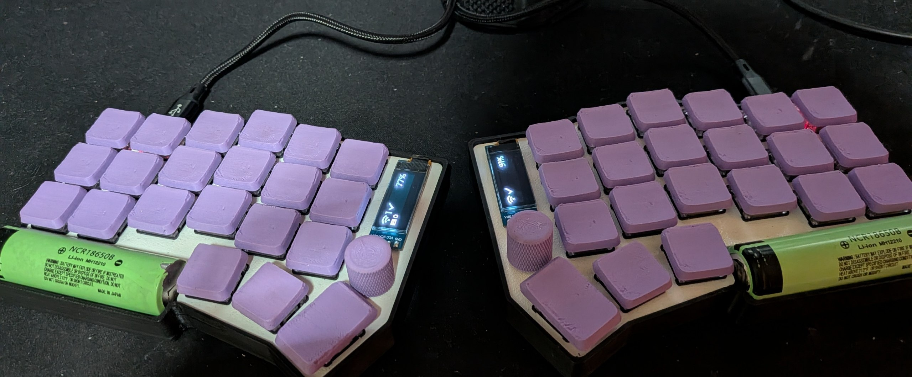
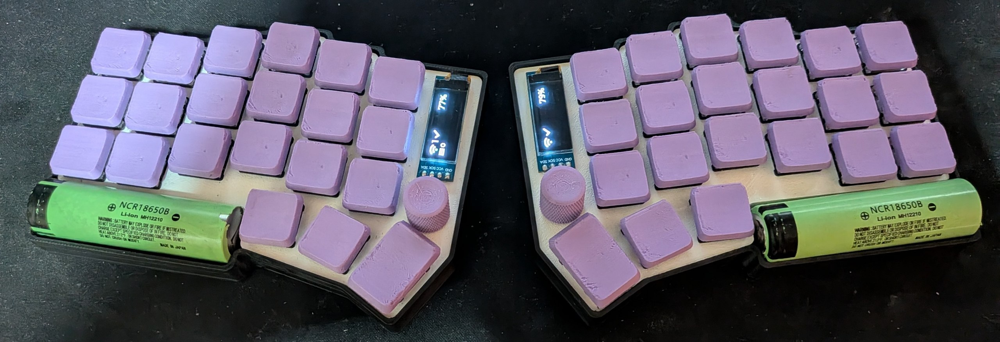
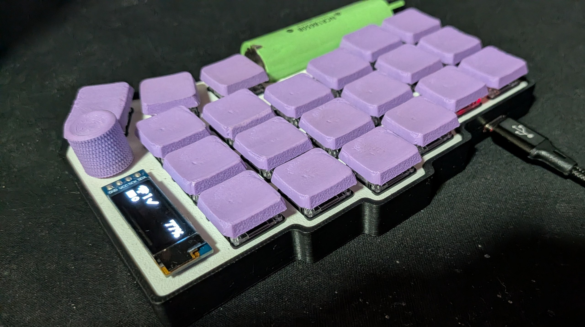

# Full 3D Printed Keyboard BLE

<p align="center">
  
  
  
</p>

A fully 3D-printed wireless split keyboard powered by [ZMK Firmware](https://zmk.dev/) running on nice!nano v2 microcontrollers. Features BLE connectivity, dual rotary encoders, OLED displays, and an Italian QWERTY layout with 5 programmable layers.

## Features

- **Wireless split design** -- BLE communication between left (central) and right (peripheral) halves
- **Dual EC11 rotary encoders** -- volume/brightness control on each half
- **OLED displays** -- SSD1306 0.91" 128x32 on each half via I2C
- **Battery powered** -- LiPo batteries with BLE power optimized at 0 dBm
- **Italian QWERTY layout** -- designed for Italian OS keyboard layout
- **5 programmable layers**:
  - Layer 0: Base (QWERTY with hold-tap and layer-tap)
  - Layer 1: Accents (Italian vowels: a, e, i, o, u)
  - Layer 2: Symbols & Numpad
  - Layer 3: Functions & Numbers (F1-F12, number row)
  - Layer 4: Gaming Mode (hold-tap disabled for zero latency)
- **Mod-morph behaviors** -- shift-aware punctuation (`'`/`"`, `;`/`:`, `,`/`<`, `.`/`>`)
- **USB fallback** -- wired connection when battery is depleted

## Hardware

| Component | Specification |
|-----------|--------------|
| Microcontroller | nice!nano v2 (nRF52840) |
| Firmware | ZMK |
| Encoders | EC11 rotary encoder x2 |
| Displays | SSD1306 OLED 0.91" 128x32 (I2C) x2 |
| Connectivity | Bluetooth Low Energy (BLE 5.0) |
| Switches | MX-compatible |

## Keymap Layers

### Layer 0: Base (QWERTY)

Standard typing layer with mod-taps on the thumb cluster and layer-taps on specific keys.

```
Left Hand                                       Right Hand
ESC     Q    W    E      R      T               Y      U      I      O      P      BKSP
LSFT    A    S    D      F      G               H      J      K      L      -      ENT
LCTRL   TAB  Z    X      C      V (L3)          B (L3) N      M      ,<     .>     ' (L1)
                  LALT   ! (L2) Win/Spc         Spc    ; (L2) DEL
```

- `V` / `B`: hold to activate Layer 3 (Functions), tap for V / B.
- `'` (Quote): hold to activate Layer 1 (Accents), tap for `'` (Shift: `"`).
- `!` / `;`: hold to activate Layer 2 (Symbols/Numpad), tap for `!` / `;` (Shift on `;`: `:`).
- `,` / `.`: with Shift produce `<` / `>`.
- Thumb encoders: volume and brightness.

### Layer 1: Accents (Italian)

Activated by holding the `'` key. Provides Italian accented vowels (requires Italian OS layout).

```
Left Hand                                       Right Hand
ESC     Q    W    é      è      T               Y      ù      ì      ò      P      BKSP
LSFT    à    S    D      F      G               H      J      K      L      +      ENT
LCTRL   TAB  Z    X      C      V               B      N      M      ,      \      ~
                  LALT   !      Spc             Spc    ;      DEL
```

### Layer 2: Symbols & Numpad

Activated by holding `!` or `;`. Symbols on the left, numpad and arrows on the right.

```
Left Hand                                       Right Hand
%       |    ^    &      {      }               7      8      9      /      *      BKSP
CAPS    @    $    #      [      ]               4      5      6      +      UP     =
RSFT    RCTRL .   ?      (      )               1      2      3      LEFT   DOWN   RIGHT
                  RALT   WIN    \               0      WIN    DEL
```

### Layer 3: Functions & Numbers

Activated by holding `V` or `B`.

```
Left Hand                                       Right Hand
F1      F2   F3   F4     F5     F6              F7     F8     F9     F10    F11    F12
1       2    3    4      5      6               7      8      9      0      -      -
-       -    TGL4 PSCRN  NUM    -               -      NUM    PSCRN  TGL4   -      -
                  -      -      TGL4            TGL4   -      -
```

- `TGL4`: toggles Layer 4 (Gaming Mode).

### Layer 4: Gaming Mode

Hold-taps disabled for zero latency; WASD prioritized. Toggle with `TGL4` from Layer 3.

```
Left Hand                                       Right Hand
ESC     Q    W    E      R      T               TGL4   U      -      -      BKSP   -
LSFT    A    S    D      F      G               -      -      -      -      -      ENT
LCTRL   TAB  -    1      2      3               4      5      6      7      8      9
                  RALT   Z      Spc             -      -      DEL
```

## Project Structure

```
boards/shields/custom/
  custom.dtsi              # Shared devicetree (encoders, matrix transform)
  custom_left.keymap       # Left half keymap
  custom_left.overlay      # Left half hardware definition
  custom_right.keymap      # Right half keymap
  custom_right.overlay     # Right half hardware definition
config/
  custom_left.conf         # Left half ZMK config (central role)
  custom_right.conf        # Right half ZMK config (peripheral role)
  west.yml                 # Zephyr west manifest
build.yaml                 # GitHub Actions CI build matrix
```

## Building

### Prerequisites

- [Zephyr SDK](https://docs.zephyrproject.org/latest/develop/getting_started/index.html) installed (tested with 0.16.8)
- `west` installed (`pip install west`)
- ZMK source tree cloned in `zmk/` (this directory is gitignored):

```bash
git clone https://github.com/zmkfirmware/zmk zmk
cd zmk
west init -l app
west update
```

### Local build

All build commands run from `zmk/app`. `ZMK_CONFIG` must point to the `config/`
directory of this repository so ZMK picks up `custom_left.conf`,
`custom_right.conf` and the shields in `boards/`:

```bash
cd zmk/app
export ZMK_CONFIG=<path-to-this-repo>/config

# Left half (central)
west build -d build/left -s . -p -- -DBOARD=nice_nano -DSHIELD=custom_left

# Right half (peripheral)
west build -d build/right -s . -p -- -DBOARD=nice_nano -DSHIELD=custom_right
```

On subsequent builds (CMake cache already configured) you can simply run:

```bash
west build -d build/left -s .
west build -d build/right -s .
```

The firmware images are generated at:

- `zmk/app/build/left/zephyr/zmk.uf2`
- `zmk/app/build/right/zephyr/zmk.uf2`

### GitHub Actions

Push to the repository to trigger automated builds via `build.yaml` (ZMK user-config workflow). Download the `.uf2` artifacts from the workflow run.

## Flashing

1. Double-click the reset button on the nice!nano to enter bootloader mode
2. Mount the `NICENANO` USB drive
3. Copy the corresponding `.uf2` file:

```bash
# Left half
cp zmk/app/build/left/zephyr/zmk.uf2 /run/media/$USER/NICENANO/

# Right half
cp zmk/app/build/right/zephyr/zmk.uf2 /run/media/$USER/NICENANO/
```

## Pairing the Two Halves

Flash `settings_reset.uf2` on both halves first to clear previous BLE bonds, then flash the firmware. The halves will automatically pair on boot.

To connect to a host device, use the key combos defined in the keymap:
- **ESC + T** (hold 500ms): Clear all BLE bonds
- **W + E** (hold 50ms): Select BLE profile 0
- **E + R** (hold 50ms): Select BLE profile 1
- **R + T** (hold 50ms): Select BLE profile 2

## License

MIT
